# MS2SL: Multimodal Spoken Data-Driven Continuous Sign Language Production
While current sign language translation technology has made significant strides, there is still no viable solution for generating sign sequences directly from spoken content, e.g., text or speech. 
In this paper, we propose a unified framework for continuous sign language production toease communication between sign and non-sign language users. The framework can capably convert multimodal 
spoken data (speech or text) into continuous sign keypoint sequences. In particular, a sequence diffusion model is crafted to step-by-step generate sign predictions, employing text or speech audio 
embeddings extracted by pretrained models like CLIP and HuBert. Moreover, by formulating a joint embedding space for text, audio, and sign, we bind data from the three modalities and leverage the 
semantic consistency across modalities to provide informative feedback signals for the training of diffusion model. This embedding-consistency learning strategy minimizes the reliance on triplet 
sign language data and ensures continuous model refinement, even with a missing audio modality. Experiments on How2Sign and PHOENIX14T datasets demonstrate that our model achieves competitive 
performance in producing signs from both speech and text data.

# How2Sign
## Text-to-Sign
**Text:** Let me demonstrate you this on my back because it's a lot easier.

<table style="width: 100%; margin-left: auto; margin-right: auto;">
    <tr>
    	<td><style="width: 16.6%;">Raw Video</td>
    	<td> &nbsp;&nbsp;&nbsp; GT  &nbsp;&nbsp;</td>
	<td> &nbsp;&nbsp; MOMP &nbsp;</td>
	<td> &nbsp;Ham2Pose &nbsp;</td>
	<td> &nbsp;&nbsp;  T2M-GPT &nbsp;&nbsp;</td>
	<td> &nbsp;&nbsp;&nbsp; Ours &nbsp;&nbsp;</td>
    </tr>
    <tr>
    	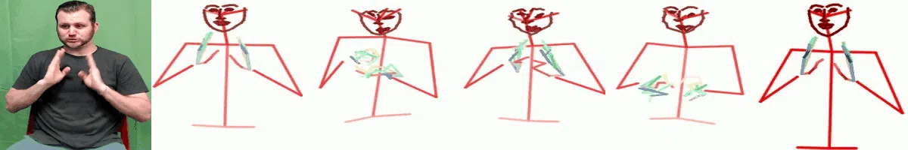
	<!--
	<td></td>
    	<td>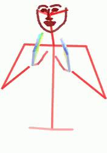</td>
    	<td>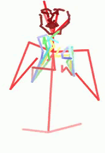</td>
	<td>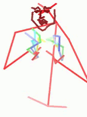</td>
	<td>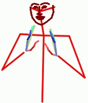</td>
	 -->
    </tr>
	   
</table>

-------------------------------------------------------------------------------------------------------------------------------------------------------------------------------------------------------------

**Text:** I have got some leather mittens here.

<table style="width: 100%; margin-left: auto; margin-right: auto;">
    <tr>
    	<td> Raw </td>
    	<td> &nbsp;&nbsp;&nbsp; GT  &nbsp;&nbsp;</td>
	<td> &nbsp;&nbsp; MOMP &nbsp;</td>
	<td> &nbsp;Ham2Pose &nbsp;</td>
	<td> &nbsp;&nbsp;  T2M-GPT &nbsp;&nbsp;</td>
	<td> &nbsp;&nbsp;&nbsp; Ours &nbsp;&nbsp;</td>
    </tr>
    <tr>
    	<td>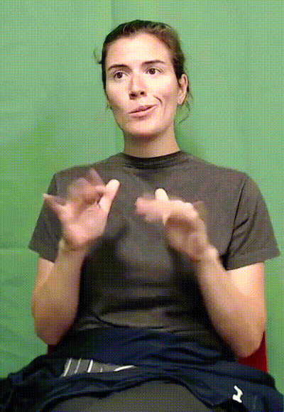</td>
    	<td>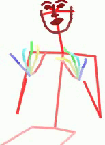</td>
    	<td>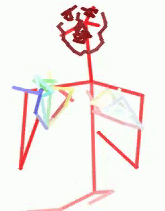</td>
	<td>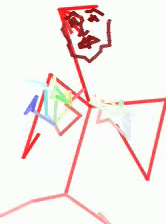</td>
	<td>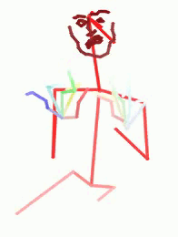</td>

    </tr>
</table>

## Audio-to-Sign

**Text:** And I'm actually going to lock my wrists when I pike.
<audio src="./samples/-g0iPSnQt6w_12-1-rgb_front/-g0iPSnQt6w_12-1-rgb_front.mp3" controls style="width: 300px;" type="audio/mpeg"></audio>
<table style="width: 100%; margin-left: auto; margin-right: auto;">
    <tr>
    	<td> &nbsp;&nbsp;&nbsp;Raw video </td>
    	<td> &nbsp;&nbsp;&nbsp;&nbsp;&nbsp;&nbsp;&nbsp;&nbsp;&nbsp;&nbsp;&nbsp;&nbsp; GT </td>
	<td> &nbsp;&nbsp;&nbsp; Ham2Pose </td>
	<td> &nbsp;&nbsp;&nbsp;&nbsp;&nbsp; T2M-GPT </td>
	<td> &nbsp;&nbsp;&nbsp;&nbsp;&nbsp;&nbsp;&nbsp;&nbsp;&nbsp; Ours </td>
    </tr>
    <tr>
    	<td></td>
    	<td>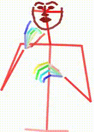</td>
    	<td>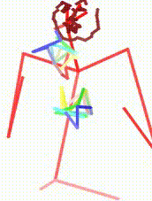</td>
	<td></td>
	<td></td>
    </tr>
</table>

-------------------------------------------------------------------------------------------------------------------------------------------------------------------------------------------------------------

**Text:** The rudder is the vertical stabilizer.
<audio src="./samples/-fZc293MpJk_6-1-rgb_front/-fZc293MpJk_6-1-rgb_front.mp3" controls style="width: 300px;" type="audio/mpeg"></audio>

<table style="width: 100%; margin-left: auto; margin-right: auto;">
    <tr>
    	<td> &nbsp;&nbsp;&nbsp;Raw video </td>
    	<td> &nbsp;&nbsp;&nbsp;&nbsp;&nbsp;&nbsp;&nbsp;&nbsp;&nbsp;&nbsp;&nbsp;&nbsp; GT </td>
	<td> &nbsp;&nbsp;&nbsp; Ham2Pose </td>
	<td> &nbsp;&nbsp;&nbsp;&nbsp;&nbsp; T2M-GPT </td>
	<td> &nbsp;&nbsp;&nbsp;&nbsp;&nbsp;&nbsp;&nbsp;&nbsp;&nbsp; Ours </td>
    </tr>
    <tr>
    	<td></td>
    	<td>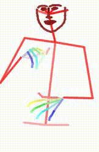</td>
    	<td>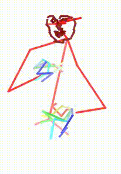</td>
	<td>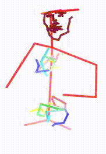</td>
	<td>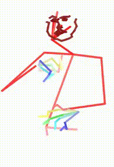</td>
    </tr>
</table>
